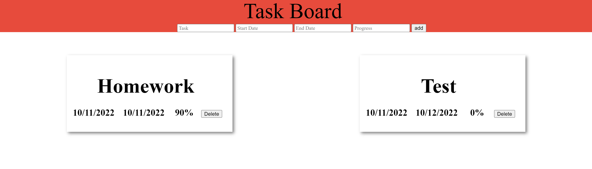

# Taskboard

a simple web app for creating task
has secure authentiaction
uses proper rest endpoints for editing and creation of tasks



## Resource

**Tasks**

Attributes:

* name (string)
* Start Date (string)
* End Date (string)
* Progress (int)

**Users**

Attributes:

* email (string)
* First Name (string)
* Last Name (string)
* Password (string)
* Passwords are encoded useing bcrypt

## Schema

```sql
CREATE TABLE tasks (
id INTEGER PRIMARY KEY,
name TEXT,
startDate TEXT,
endDate TEXT,
progress INTEGER);

CREATE TABLE users (
id INTEGER PRIMARY KEY,
email TEXT,
namef TEXT,
namel TEXT,
password TEXT);
```

## REST Endpoints

Name                     | Method | Path
-------------------------|--------|------------------
Retrieve Task collection | GET    | /tasks
Retrieve Task member     | GET    | /tasks/*\<id\>*
Create Task member       | POST   | /tasks
Update Task member       | PUT    | /tasks/*\<id\>*
Delete Task member       | DELETE | /tasks/*\<id\>*
Create user and login    | POST   | /users
Login on the website     | POST   | /sessions